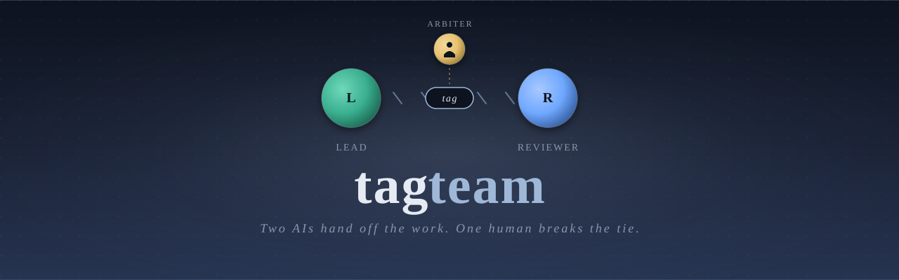
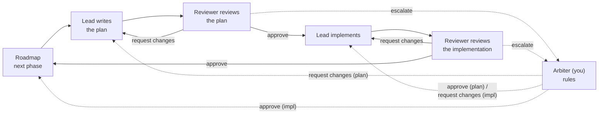
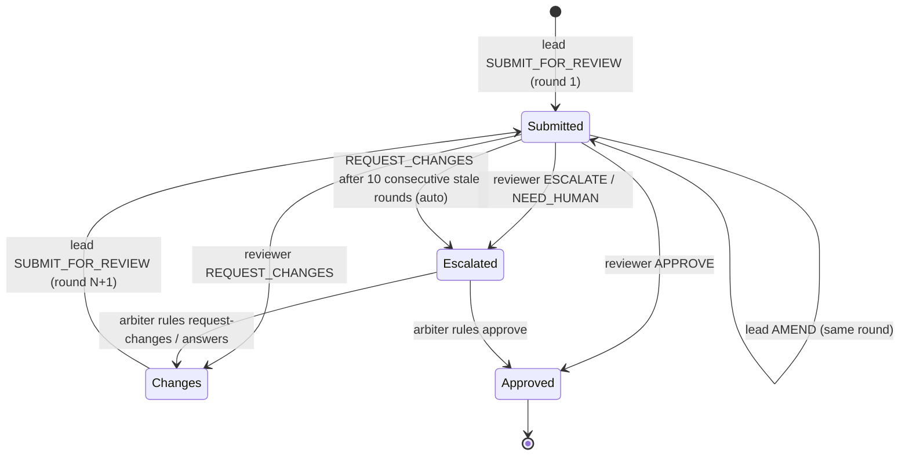
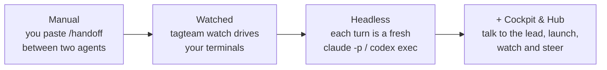
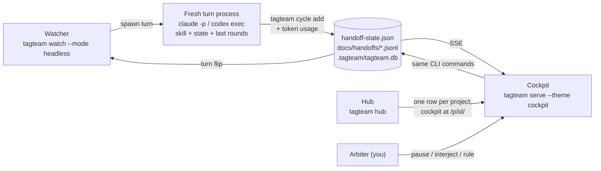
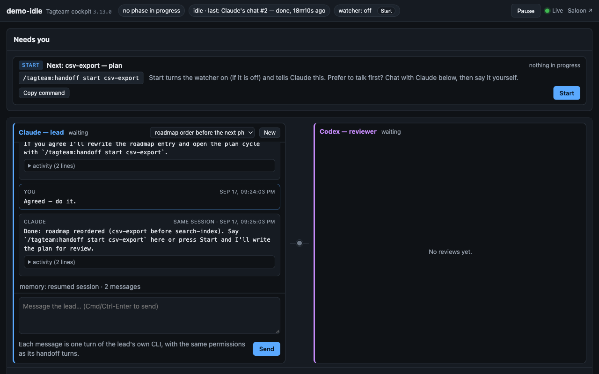
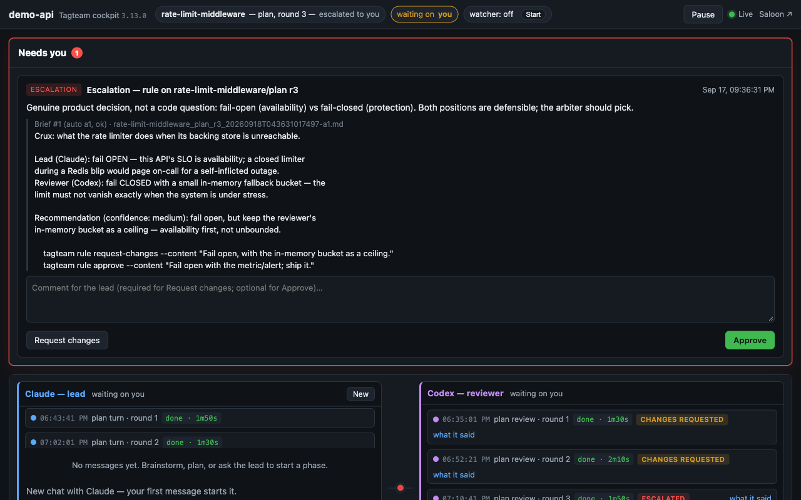
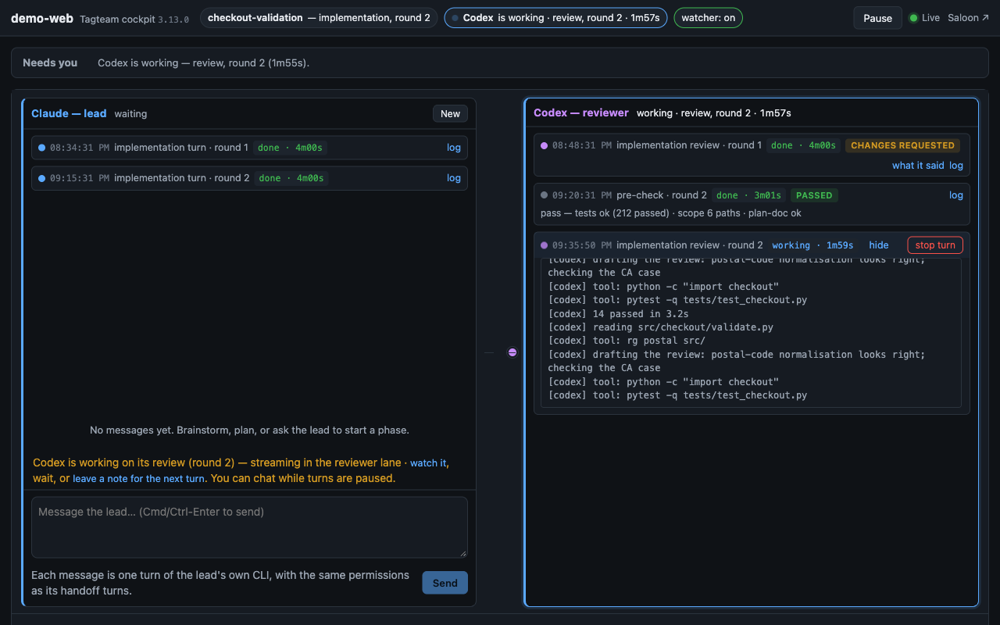
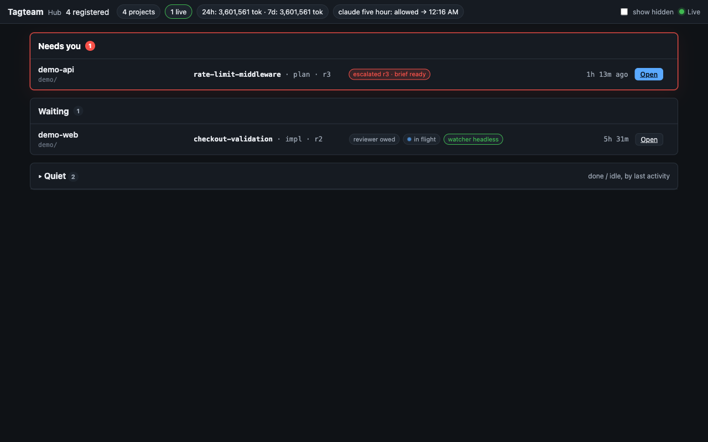

<p align="center">
  
</p>

# Tagteam

**Two AIs hand off the work, one human breaks the tie.** One AI agent leads, a second reviews, and you arbitrate — phase by phase, from a roadmap, with every round on the record.

## The loop



- **Lead** (one AI agent) plans each phase, then implements the approved plan.
- **Reviewer** (a second AI agent) reviews both — the plan, then the implementation — and approves, requests changes, or escalates.
- **Arbiter** (you) enters only when the two cannot settle it: an escalation, a question only a human can answer, or a cycle that stopped making progress. Your ruling takes the reviewer's seat: **request changes** hands the turn back to the Lead; **approve** closes the cycle — an approved plan goes to implementation, an approved implementation advances the roadmap.

Each phase in `docs/roadmap.md` goes through two cycles — **plan**, then **impl** — and each cycle is a sequence of **rounds** (one lead submission, one reviewer response). Every round is appended to `docs/handoffs/`, and `handoff-state.json` says whose turn it is; either agent can pick up where the other left off.

## Why

An AI grading its own work rarely catches its own blind spots; a second model with a different training does. Long agent sessions drift and get expensive; short, bounded turns don't. And a human who has to relay every message is the bottleneck — the loop should run by itself and call you only when it needs a decision. Tagteam is the smallest structure that gets all three: a lead, a reviewer, and a record.

## Try it

```bash
pip install tagteam
cd ~/projects/myproject
tagteam quickstart
```

**Claude Code plugin (3.10+).** The handoff contract Claude follows can be installed once as a plugin — invoked as `/tagteam:handoff` — instead of being copied into every project — one contract, kept in lockstep with the CLI, plus a `SessionStart` hook that prints the current cycle (`tagteam: phase … | round … | turn …`) when you open a tagteam project:

```text
/plugin marketplace add jblacketter/tagteam
/plugin install tagteam@tagteam
```

With the plugin installed and enabled, `tagteam setup` (and `tagteam upgrade`) removes the vendored `.claude/skills/handoff/` from a project — only when it is byte-for-byte a contract tagteam shipped; a customized copy or extra files are kept and reported — and headless turns compose their prompt from the packaged contract. Without the plugin, `setup` vendors the skill; `tagteam setup --no-plugin` forces that. The hook is silent outside tagteam projects and never fails a session start. A project that still vendors the skill invokes the same contract as `/handoff`; agents without Claude Code's plugin skills (Codex) read it with `tagteam contract`.

**Safe migration (3.13).** `setup` and `upgrade` no longer overwrite. Every managed file (`templates/*.md`, `docs/checklists/*.md`, `docs/workflows.md`, the vendored skill) is classified against the package and the project's committed `tagteam-manifest.json` of what tagteam last wrote: files that are provably tagteam's are refreshed, anything else is kept and reported with the exact `tagteam setup DIR --accept PATH` line that would overwrite it (or delete a pre-plugin `.claude/skills/handoff-*.md`). An accept needs the path tracked and clean in git so `git checkout -- PATH` can undo it; `--force` lifts only that. `--preview` writes nothing. A second run on a migrated project is a byte-identical no-op. Symlinks and non-regular files at any managed path are refused under every flag. Old projects with templates rendered by an earlier tagteam ("Lead: Claude") see them as custom on the first run — preview, then accept the ones you never edited.

You'll be prompted for your two agent names, then quickstart sets up the workspace and starts a session. It auto-detects the best terminal backend available on your machine:

- **iTerm2** (macOS, default when iTerm2 is installed) — opens three labeled tabs in a single window, auto-launching iTerm2 if it isn't already running.
- **tmux** (Linux, WSL, or macOS without iTerm2) — creates one `tmux` session with three labeled panes.
- **Terminal.app** (macOS with neither iTerm2 nor tmux — nothing to install) — opens three labeled *windows* (Lead, Watcher, Reviewer) in the built-in Terminal. Also available anywhere on macOS with `--backend terminal`. The first run asks macOS for permission to control Terminal (System Settings → Privacy & Security → Automation) — allow it once.
- **manual** (anywhere else, including Windows without WSL) — prints the three commands for you to run in terminals you open yourself.

When quickstart finishes it prints what to paste into the Lead and Reviewer agents to kick off the first phase. Override the auto-detection with `--backend iterm2|tmux|terminal|manual` if you need a specific one.

**Single phase** — start a plan cycle, let the watcher handle the back-and-forth, and stop when the phase completes:

```text
/tagteam:handoff start my-phase
```

**Full roadmap** — run all incomplete phases end-to-end:

```text
/tagteam:handoff start --roadmap
/tagteam:handoff start --roadmap api-gateway
```

| Command                         | Purpose                                         | Who  |
| ------------------------------- | ----------------------------------------------- | ---- |
| `/tagteam:handoff`                      | Auto-detects role + state, does the right thing | Both |
| `/tagteam:handoff start [phase]`        | Begin a new phase (plan cycle)                  | Lead |
| `/tagteam:handoff start [phase] impl`   | Begin the implementation cycle for a phase      | Lead |
| `/tagteam:handoff status`               | Orientation, status check, drift reset          | Both |

**Human-in-the-loop** — add `--confirm` to pause for approval before each automatic send: `tagteam watch --mode notify --confirm`.

<details>
<summary>tmux (explicit invocation)</summary>

```bash
tagteam quickstart --backend tmux
```

Creates one `tmux` session named `tagteam` with three labeled panes (Lead, Watcher, Reviewer). Attach later with `tmux attach -t tagteam`.

</details>

<details>
<summary>Windows / manual fallback</summary>

On Windows without WSL, terminal automation (iTerm2/tmux) isn't available. You have two options:

1. **Headless mode** (recommended, fully automated) — no terminals to drive at all; each turn is a fresh `claude -p` / `codex exec` process. See [Headless](#headless-fresh-process-per-turn) below.
2. **Manual fallback** — quickstart prints the commands for you to run yourself in three terminals:

```bash
tagteam quickstart --backend manual
```

You can also run each step individually:

```bash
tagteam setup
tagteam init
tagteam session start --backend manual
tagteam watch --mode notify
```

</details>

<details>
<summary>Advanced setup (run each step yourself)</summary>

```bash
tagteam setup               # copy skills, templates, docs
tagteam init                # interactive agent config → tagteam.yaml
tagteam session start       # create terminals and auto-launch agents
```

Options:

- `tagteam session start --no-launch` — create terminals but don't start agents
- `tagteam session start --backend <name>` — force a specific backend
- `tagteam session kill` — close the current session

> **Manual mode:** you can always run the loop without any automation by pasting `/tagteam:handoff` output between agents yourself.

</details>

## One cycle



A cycle ends when the reviewer approves. It comes to you when the reviewer escalates, asks a question only a human can answer, or when the lead has re-submitted unchanged content for **10 consecutive stale rounds** — a cycle that is still making progress can go well beyond ten rounds without escalating. When it does come to you, `tagteam brief` gives you a decision brief (each side's position, the crux, a recommendation, the exact commands) and `tagteam rule approve|request-changes|answer` puts your ruling on the record — or do both from the cockpit's **Needs you** card. Details: [escalations and the briefer](docs/how-tagteam-works.md#escalations).

## Choose how much runs by itself



Every rung is the same loop and the same files; only the automation changes. **Manual** costs nothing to set up. **Watched** (`tagteam watch --mode notify|iterm2|terminal|tmux`) types the next command into the right terminal for you. **Headless** is for running unattended, on Windows, or whenever long-lived agent sessions become the problem. The **cockpit** starts any of them from the browser and lets you talk to the lead without a terminal.

### Headless: fresh process per turn



Instead of typing commands into long-lived agent terminals, the watcher can spawn each turn as a **fresh process** through the agent's own signed-in CLI (`claude -p` for Claude, `codex exec` for Codex — subscription auth, no API keys). Every turn gets a bounded context (the handoff skill contract + `handoff-state.json` + the last few rounds), writes its own round with `tagteam cycle add`, and its token usage is recorded. Nothing runs headless unless you ask:

```bash
tagteam watch --mode headless          # never auto-detected; explicit opt-in only
tagteam tail                           # follow the in-flight turn like CI logs
```

**When something goes wrong** (a turn times out, exits nonzero, exits without writing its round, or the CLI cannot start), the watcher pauses dispatch, writes `.tagteam/headless-paused.json` with the reason and log path, and notifies you. It never retries silently. Per-role options (`provider`, `executable`, `args`, `timeout_minutes`) live under `agents.<role>.headless` in `tagteam.yaml`; opt-in retries re-run a turn only when it provably did nothing. Details, defaults and the validation rules: [headless mode](docs/how-tagteam-works.md#headless).

**Arbiter controls (any watcher mode):**

```bash
tagteam pause --reason "reviewing by hand"    # every watcher mode holds dispatch
tagteam resume                                # clears the hold; the owed turn is re-dispatched once
tagteam cancel-turn                           # kill the in-flight headless turn → outcome 'cancelled', then paused
tagteam interject "prefer the smaller diff"   # note for the next turn (--to lead|reviewer to target a role)
tagteam interject --list                      # pending / delivered / retired notes for this cycle
tagteam interject --retire 3                  # close a note without delivering it
tagteam usage [--by role|cycle|model|kind] [--json]   # per-turn tokens and roll-ups (no dollars in text)
tagteam report --phase P [--json]             # what a phase took: rounds, bounces, gate/turn time, usage coverage
```

How each of these behaves (pause markers, cancel-turn identity checks, interjection scoping, retries, notifications, `tagteam rollback`): [arbiter controls](docs/how-tagteam-works.md#controls).

### Gatekeeper: don't spend a reviewer turn on a broken build

```yaml
# tagteam.yaml
gatekeeper:
  enabled: true                       # opt-in; absent = off
  tests:
    command: "python -m pytest -q"
```

With the gate on, every impl submission is checked **before** the reviewer's turn — by a script, not a model: the test command runs, the submission must contain real implementation work since the plan was approved (an impl cycle opened over an unchanged tree fails), and the phase plan must exist. Green → a one-line report is attached to the round and the reviewer starts with the facts; red → the turn bounces straight back to the lead with the failing output, and no reviewer tokens or rounds are spent. Two consecutive bounces and the gate passes-with-findings so nobody gets trapped. `tagteam gate check` is the lead's pre-flight; `tagteam gate status` shows the last report. Runs in every watcher mode; without a watcher, `tagteam gate run` — or set `on_submit: true` (3.5) and the lead's own `cycle add … SUBMIT_FOR_REVIEW` runs the gate synchronously, so the round's **one** full-suite run is on the record whether or not a watcher is up (`gate check --skip-tests` becomes the pre-flight; the reviewer starts from the gate entry instead of re-running the suite). Details: [gatekeeper pre-checks](docs/how-tagteam-works.md#gatekeeper), [the one-run rule](docs/how-tagteam-works.md#one-run).

### Reviewer panels: three narrow reviews, one response

```yaml
# tagteam.yaml
panel:
  enabled: true                       # opt-in; absent = off
  lenses: [correctness, scope, verification]
```

With the panel on, the reviewer's turn on impl cycles is taken by 2–3 independent **lens** reviews — each a fresh reviewer process with a one-axis brief (does it do what the plan says? is everything there and nothing extra? is it verified?) writing a structured verdict — merged deterministically into **one** reviewer entry: `PANEL: REQUEST_CHANGES — …` with findings grouped by lens, or `PANEL: APPROVE` only when every lens approves. A lens that fails never causes a partial approval: the ordinary reviewer turn runs instead. Runs after the gate in every watcher mode; `tagteam panel status|lenses|preview --lens L|run`. Details: [reviewer panels](docs/how-tagteam-works.md#panels).

### Roadmap as a DAG: dependencies, readiness, parallel phases in worktrees

```markdown
### Phase 40: Roadmap as a DAG (3.4)
- **Status:** In progress
- **Depends on:** Phase 35, Phase 39          # optional; slug, `Phase N` or the exact name
```

Phases can declare what they depend on and tagteam treats the roadmap as a **directed acyclic graph**: `tagteam roadmap queue` is a stable topological order (a roadmap without `Depends on` lines queues exactly as before), `roadmap ready` lists what can start now, `roadmap check` reports every identity or edge problem, `roadmap graph [--mermaid]` draws it. In full-roadmap mode the watcher **never starts a blocked phase** — it re-reads the roadmap on every advance, skips phases completed elsewhere, pauses with the reason when everything left is blocked, and `tagteam roadmap resume` continues once you merged the dependency. Independent phases can run **in parallel**: `tagteam roadmap worktree <phase>` gives a ready phase its own git worktree (`../<repo>-<phase>`, branch `phase-<slug>`), registered as its own tagteam project — its own state, watcher, gate and panel — and `roadmap worktrees` / `--remove` track and clean up merged ones. Details: [roadmap as a DAG](docs/how-tagteam-works.md#roadmap-dag).

## Talk to the lead, launch, watch and steer

**The Cockpit** — the browser surface for one project, built around the arbiter's actual job: *how do I begin?*, *let me tell the lead something*, *does anything need me?*, then *is it healthy and what is it doing?*

```bash
tagteam serve                    # http://127.0.0.1:8080 — the cockpit for the current project (3.1: default)
tagteam serve --dir ~/projects/myproject --port 8081
```

- **Start card** — when nothing is in progress, *Needs you* shows the exact next step derived from the recorded state and your roadmap (a new phase's plan; after a plan is approved, that phase's implementation; after an implementation, the next open phase) and one **Start**: it turns the watcher on (if it is off) and tells the lead `/tagteam:handoff start …` as the first message of a chat; every turn from then on runs from the page. Prefer to talk first? Chat with the lead, then say the command yourself. (Terminal people start from the terminal — `tagteam session start` — and the cockpit still watches.)
- **Chat with the lead** — the left lane, named after your lead agent: brainstorm, plan, say `/tagteam:handoff start <phase>`, and after implementation give feedback or close the phase. Each message is one turn of the lead's own CLI (`claude -p` / `codex exec`, resumed across messages, streamed live, transcript under `.tagteam/conversations/`), with the same permissions as its handoff turns. It never runs on top of the watcher's lead turn — Send is refused while the lead is working on its turn (leave a note instead), and a chat blocks the watcher's lead dispatch until it ends. `tagteam lead "message"` is the same thing from the terminal.

<p align="center"></p>

<p align="center"></p>

- **Two lanes** (3.8) — a running handoff is unmistakable and in the order it runs: **`claude — lead`** on the left (the chat, with Claude's cycle turns as cards between your messages, composer at the foot) and **`codex — reviewer`** on the right (each round's pre-check → review → verdict — *approved · changes requested · escalated*), the turn token between them, the working lane pulsing, the running turn streaming in place, newest at the foot. Finished turns *stay* with a plain outcome (`done · cancelled · failed · timed out · process disappeared · no result recorded`) and a log link; the flat list of every turn is an *all activity* disclosure on the Rounds tab. **Start** acknowledges within one refresh.

<p align="center"></p>

The page reads top to bottom in attention order and in your words: the **Now** strip (the project first — you can serve the wrong one — then the phase and round, who is working or who we are waiting on, the watcher on / off with its one action, the connection); the **Needs you** banner — one card per thing only the human can do, red only when a human is required (an escalation, a question, paused turns, a lost process, a turn waiting while the watcher is off), a quiet one-liner otherwise; the two **lanes**; the tabs — Rounds (with *all activity*), Diff, Usage, Notes. Every button is the CLI command with the same effect, recorded as `by = web:<user>`. The cockpit binds **127.0.0.1** by default and guards every POST with a per-run page token; `--host 0.0.0.0` exposes it on the network — including the ability to run agent turns and launch processes — and is your call. Two `tagteam serve` on one port never shadow each other: the second refuses and names the first. Zones, the launchpad, the lead conversation model and the security model in full: [the cockpit](docs/how-tagteam-works.md#cockpit), [talking to the lead](docs/how-tagteam-works.md#lead).

**The Hub** — every project you've set up, in one list ranked by what needs you.

```bash
tagteam hub                     # http://localhost:8090 — every registered project, ranked by what needs you
tagteam hub --list [--json]     # the same triage as text
```

<p align="center"></p>

**Needs you** → **Waiting** (turns owed to agents; **stale** when nothing is dispatching) → **Quiet**, with burn across projects and the shared subscription window in the strip. **Open** takes you into that project's cockpit, mounted at `/p/<id>/`; a project with a next step shows **Start →** straight to its cockpit's Start card. The hub is read-only: it never migrates a project database and never rewrites the registry (`tagteam registry list|unregister PATH`). Details: [the hub](docs/how-tagteam-works.md#hub).

**The Saloon** — the original western-themed dashboard survives as a theme: `tagteam serve --theme saloon` (identical to the pre-3.1 bare `serve`), and inside the cockpit at `/?theme=saloon`. [More](docs/how-tagteam-works.md#saloon).

## Reference

**Configuration** — agents are defined in `tagteam.yaml`:

```yaml
agents:
  lead:
    name: claude
    command: claude
  reviewer:
    name: codex
    command: codex
```

**CLI reference:**

```bash
tagteam quickstart                     # Setup + init + session start
tagteam session start                  # Auto-detect backend, launch agents
tagteam session start --backend manual # Force manual backend
tagteam session start --no-launch      # Create terminals, skip agent launch
tagteam session kill
tagteam init
tagteam setup                          # bring framework files up to the package: refreshes only what tagteam wrote, keeps custom files
tagteam setup --preview                # classify and report, write nothing
tagteam setup --accept templates/cycle.md   # overwrite (or, for a legacy flat skill, delete) one custom path — needs it tracked and clean; --force lifts that
tagteam setup --no-plugin              # force vendoring the handoff skill
tagteam hook session-start             # the plugin's SessionStart hook body: cycle banner + version-skew warning
tagteam contract                       # print the handoff contract (for agents without the plugin, e.g. Codex); --path
tagteam migrate                        # migrate a legacy project to tagteam.yaml
tagteam state
tagteam state diagnose
tagteam watch --mode notify
tagteam watch --mode headless          # spawn each turn as a fresh agent process
tagteam watch --pidfile                # keep .tagteam/watcher.json for the cockpit's liveness strip
tagteam tail                           # follow the in-flight headless turn
tagteam cycle rounds --phase P --type plan --tail 3
tagteam pause --reason "..." / tagteam resume / tagteam cancel-turn
tagteam interject "note" [--to lead|reviewer] / --list / --retire ID
tagteam usage [--by role|cycle|model|kind]... [--json]
tagteam report --phase P [--json]      # read-only phase measurement; paste into the phase doc's closeout
tagteam serve [--theme cockpit|saloon] [--host H] [--port N] [--max-sse N]   # the cockpit (default); saloon = legacy dashboard
tagteam lead "message" [--new] [--conversation ID] / --list           # talk to the lead from the terminal
tagteam hub [--list [--json]] [--all] [--port 8090]                   # all registered projects; cockpits at /p/<id>/
tagteam registry list [--json] | unregister PATH
tagteam brief [--list | --generate | --event KEY]
tagteam gate check [--skip-tests] | run | status [--json] | list   # gatekeeper pre-checks (opt-in `gatekeeper:` block; `on_submit: true` gates from `cycle add`)
tagteam panel run | status [--json] | list | lenses | preview --lens L   # reviewer panel (opt-in `panel:` block)
tagteam rule approve|request-changes|answer [--content ...] [--to lead|reviewer]
tagteam rollback 0.8.0 [--yes]
tagteam roadmap phases | queue [start] | check | graph [--mermaid] | ready [--json] [--roadmap-only] | resume
tagteam roadmap worktree <phase> [--from REF] [--target BRANCH] | --remove [--force]   # parallel phases (3.4)
tagteam roadmap worktrees [--json]
tagteam serve --dir .
tagteam tui                            # optional Textual TUI (pip install 'tagteam[tui]')
tagteam upgrade [--preview]            # migrate every registered project to the installed package (never accepts; prints the per-path accept line)
tagteam doctor [dir] [--json]          # read-only: legacy workflow findings, per-role executables (desktop/headless), instruction sources, tool config names
tagteam --help
```

**More:**

- [How tagteam works](docs/how-tagteam-works.md) — the long version of every section above, plus the files tagteam writes and where.
- [Showcase](docs/showcase.md) — the problem, the loop and the numbers from this repository's own use of tagteam.
- [Diagrams and screenshots](docs/media/README.md) — the SVGs in this README as standalone assets.
- [Roadmap](docs/roadmap.md), [3.0 proposal](docs/tagteam-3.0-proposal.md), per-phase plans and findings under `docs/phases/`.

## License

Apache License 2.0 — see [LICENSE](LICENSE) and [NOTICE](NOTICE). Tagteam is open
source and free to use, modify, and redistribute. The license asks that the copyright
and NOTICE attribution travel with the code, that modified files say they were changed,
and it includes an express patent grant. If tagteam is useful to you, a link back to
this repository is appreciated (see [CITATION.cff](CITATION.cff) or GitHub's "Cite this
repository" button). Releases up to and including 3.1.0 were published under MIT and
remain available under that license.
