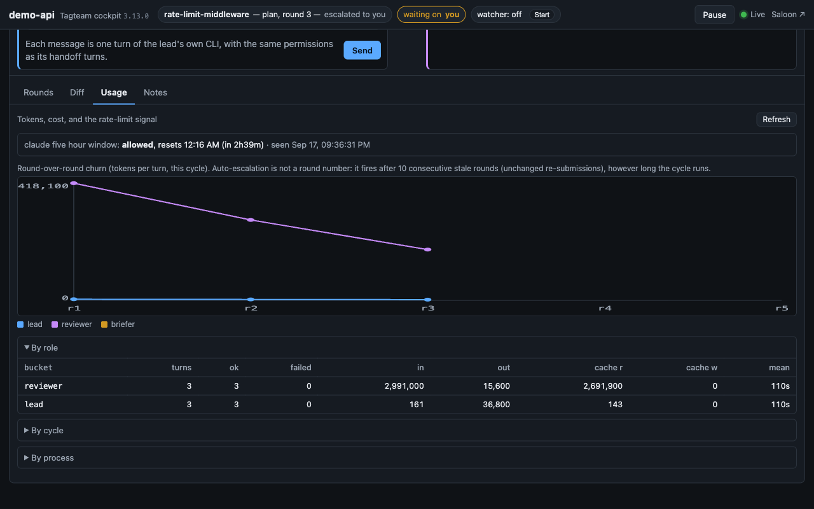

# How tagteam works

The long version of the [README](../README.md), section by section, in the
same order. Each heading below is the anchor the README links to.

- [The loop](#loop) · [One cycle](#cycle) · [Modes](#modes) · [Headless](#headless) · [Arbiter controls](#controls) · [Escalations and the briefer](#escalations) · [The cockpit](#cockpit) · [Talking to the lead](#lead) · [The hub](#hub) · [The Saloon](#saloon) · [Files tagteam writes](#files)

<a id="loop"></a>
## The loop

Work progresses phase by phase. Each phase is listed in `docs/roadmap.md` and goes through two cycles: **plan**, then **impl** (implementation). The lead opens a cycle by submitting; the reviewer responds with `APPROVE`, `REQUEST_CHANGES`, `ESCALATE` (a disagreement only the human can settle) or `NEED_HUMAN` (a question only the human can answer). Approval closes the cycle; a plan approval means "implement it, then open the impl cycle"; an impl approval means "phase complete, next phase".

State is tracked in `handoff-state.json` (current turn) and `docs/handoffs/<phase>_<type>_rounds.jsonl` + `_status.json` (per-cycle rounds). Either agent can pick up where the other left off at any time. Every cycle/state write resolves the project root by walking up from the current directory to the nearest `tagteam.yaml` before falling back to `git rev-parse` — so a nested git repository never shadows the outer tagteam project.

The agents follow one contract — served by the `tagteam` Claude Code plugin as `/tagteam:handoff` (3.10), as `/handoff` where `tagteam setup` still vendors `.claude/skills/handoff/SKILL.md`, and by `tagteam contract` for agents without plugin skills: the status banner, the action commands, the NEXT box, and the rules for amendments and headless turns. `/tagteam:handoff` reads the role from `tagteam.yaml` and the state from `handoff-state.json` and does the right thing for whoever runs it.

<a id="cycle"></a>
## One cycle

A **round** is one lead `SUBMIT_FOR_REVIEW` plus the reviewer's response. `AMEND` lets the lead attach new information to the active round without bumping the round number or returning the turn (for example, when the arbiter answers an open question mid-review). The reviewer's `REQUEST_CHANGES` hands the turn back; the lead re-submits as round N+1.

**Auto-escalation.** Every `REQUEST_CHANGES` checks how many *consecutive* lead submissions were byte-identical to the one before (the first submission is the baseline and is never itself stale). At **10 consecutive stale rounds** the cycle escalates to the arbiter automatically. A cycle that keeps changing — even slowly — never trips this; a long, progressing cycle can go well beyond ten rounds.

**Escalated / needs-human** cycles wait for the arbiter's ruling (below). A ruling `approve` closes the cycle from the reviewer's seat; `request-changes` hands the turn back to the lead without re-arming auto-escalation; `answer` (for `NEED_HUMAN`) delivers the answer as an interjection and re-arms the cycle for the role that asked.

<a id="modes"></a>
## Modes: manual, watched, headless

Every mode runs the same loop over the same files; only the automation differs.

- **Manual** — no watcher. You paste each agent's `/tagteam:handoff` output into the other agent yourself. Zero setup beyond `tagteam setup`.
- **Watched** — `tagteam watch --mode notify|iterm2|terminal|tmux` polls `handoff-state.json` and, on a turn flip, either notifies you (`notify`) or types the next command into the right terminal (`iterm2` / `terminal` / `tmux`), detecting a busy terminal first so it never interrupts in-flight work. `--confirm` pauses for your approval before each automatic send. If a turn stays `ready` (the agent never picked the command up), the **watchdog** re-sends it — since 3.5 only every `watcher.resend_minutes` (default 15; `0` = never), only when the agent's pane is *positively* idle (no busy marker anywhere in the last 8 lines, a prompt in the last 4) **and** unchanged since the previous probe, at most twice per submission; then it notifies you once and stops. Capture failure never re-sends; a new submission (`seq`) starts a fresh record. Before 3.5 the re-send was a fixed 5 minutes with a best-effort idle check, which nudged a busy agent (and its reviewer) every 5 minutes for the length of any long turn. `tagteam quickstart` / `tagteam session start` create the terminals (three tabs, panes or windows: Lead, Watcher, Reviewer) and auto-launch the agents; `default_backend()` picks iTerm2 on macOS, tmux where available, then (since 3.6) Terminal.app on a Mac with neither, and `manual` (print the commands) elsewhere.
  - **Terminal.app backend** (`--backend terminal`, 3.6): the same driver shape as iTerm2 against Apple's built-in Terminal, so a Mac needs nothing installed. Because Terminal.app cannot create *tabs* by script without the Accessibility permission, each role gets its own **window** (Lead / Watcher / Reviewer, titled and placed side by side); on a cold launch Terminal's own first window becomes the Lead's, otherwise three new windows are opened and nothing pre-existing is touched. A tab is identified by its **tty** (`/dev/ttys004` — unique among open tabs, stable for the tab's life, so it survives the user re-arranging windows); the watcher (`tagteam watch`, auto-detected from `.handoff-session.json`'s `backend` field, or `--mode terminal`) sends with two `do script … in <tab>` calls — the text (Terminal appends a newline; Claude Code submits on that already) then, 50 ms later, an empty one whose lone newline is what Codex needs, since Terminal delivers `do script` text as a paste and Codex keeps pasted text, trailing newline included, in its composer — the same text-then-Enter shape as the iTerm2 driver, after the same idle check, and reads `contents of <tab>` for the busy/idle and watchdog probes. `session kill|adopt --backend terminal|list-terminal`, `tagteam state`'s health lines and the dashboard's log tail all resolve the driver from that `backend` field (a pre-3.6 file without one is iTerm2). Quitting and restoring Terminal.app changes every tty, so the session goes stale exactly as an iTerm2 one does after iTerm2 quits — `session start` detects that and recreates it. macOS asks once (Automation) whether the app running tagteam may control Terminal; until you allow it, AppleEvents to Terminal hang and `session start` reports the launch failure with that hint.
- **Headless** — the watcher spawns each turn as a fresh CLI process. Below.

<a id="headless"></a>
## Headless mode (opt-in)

Instead of typing commands into long-lived agent terminals, the watcher can spawn each turn as a **fresh process** through the agent's own signed-in CLI (`claude -p` for Claude, `codex exec` for Codex — subscription auth, no API keys):

```bash
tagteam watch --mode headless          # never auto-detected; explicit opt-in only
tagteam tail                           # follow the in-flight turn like CI logs
```

On every turn flip the orchestrator composes a bounded context (the handoff skill contract + `handoff-state.json` + the last 3 rounds), pipes it to the agent on stdin, streams the agent's structured output to `.tagteam/turns/<phase>_<type>_r<N>_<role>_<ts>.log` (human-readable) and `.events.jsonl` (raw), and — because the agent still writes its own round with `tagteam cycle add` — verifies that the expected round landed before dispatching the other agent. Per-turn token usage is recorded in the project DB (`usage` table) for later phases to surface.

**When something goes wrong** (turn timeout — 60 min by default; nonzero exit; the agent exited without writing its round; or the CLI could not be started at all), the watcher pauses dispatch, writes `.tagteam/headless-paused.json` with the reason and log path, and sends a notification. It never retries silently. To resume: read the log, fix anything needed, delete the marker; the watcher picks up on its next tick.

```bash
tagteam watch --mode headless --turn-timeout 90 --tail-rounds 5 --confirm
tagteam cycle rounds --phase my-phase --type plan --tail 2   # last 2 entries only
```

Per-role options live under `agents.<role>.headless` in `tagteam.yaml` (all optional):

```yaml
agents:
  lead:
    name: Claude
    headless:
      provider: claude                # claude | codex (inferred from command/name if omitted)
      executable: /opt/bin/claude     # default: `claude` on PATH
      args: ["--model", "opus"]       # a YAML list; validated — no positionals, no reserved flags
  reviewer:
    name: Codex
    headless:
      args: ["-c", "approval_policy=untrusted"]
```

Defaults are the least-privileged unattended settings that still let the agent edit the repo and run the cycle CLI: Claude runs with `--permission-mode acceptEdits --allowedTools Bash Read Edit Write Glob Grep`; Codex with `--sandbox workspace-write -c approval_policy=never`. Anything you put in `args` is checked against a per-provider option table so a stray token can never become the prompt or override tagteam's own flags.

Interactive modes are unchanged — headless is a peer mode. It is also the path for **Windows**: it needs only `subprocess`, and the test suite runs on `windows-latest` in CI (a real signed-in CLI smoke on Windows is best-effort; see the Phase 31 findings doc).

<a id="controls"></a>
## Arbiter controls (any watcher mode)

```bash
tagteam pause --reason "reviewing by hand"    # every watcher mode holds dispatch
tagteam resume                                # clears the hold; the owed turn is re-dispatched once
tagteam cancel-turn                           # kill the in-flight headless turn → outcome 'cancelled', then paused
tagteam interject "prefer the smaller diff"   # note for the next turn (--to lead|reviewer to target a role)
tagteam interject --list                      # pending / delivered / retired notes for this cycle
tagteam interject --retire 3                  # close a note without delivering it
tagteam orders stop phase|roadmap [--run]     # standing order (enforced): stop after each phase, or run the roadmap
tagteam orders add "hold the PR for my approval" [--run]   # standing note (advisory: delivered every turn, not enforced)
tagteam orders                                # effective orders and where each comes from
tagteam usage [--json]                        # per-turn tokens; roll-ups by role, by cycle, totals
```

- **pause/resume** use the same marker file the engine writes on a failed turn (`.tagteam/headless-paused.json`), so `resume` also tells you what failed and where the log is.
- **cancel-turn** never signals a PID it cannot bind to the recorded turn: it checks the child's and the watcher's creation identities (recorded at spawn) and the parent pid, and if anything is stale or unverifiable it just removes the stale metadata and says so.
- **interject** notes are stored with provenance (who, when, which cycle/round/turn was owed) in the project DB and go into the *next eligible* turn's prompt under an `ARBITER INTERJECTIONS` heading (headless) or show up as `interjections` on `tagteam cycle rounds` (interactive). A note is scoped to the cycle it was written for; delivery is stamped only when the receiving turn succeeds. `--to reviewer` waits for the reviewer's turn.
- **orders** are standing orders: like an interjection that is never consumed, delivered to both agents in every turn (a `STANDING ORDERS` block in the headless prompt; on stderr above `tagteam cycle rounds`). Project orders live in a committed `tagteam-orders.json`, and `--run` sets an override in `handoff-state.json` that is dropped when its run ends. Only `stop` is enforced: when an implementation is approved, the engine records a decision on the cycle (continue / convert to a roadmap run / stop / roadmap exhausted), and `state sync` re-applies that decision without re-deciding. Advisory notes are delivered but not enforced. Without orders, nothing is written or printed.
- **Retries** (`tagteam watch --mode headless --turn-retries N`, default 0) re-run a failed turn only when it provably did nothing: the outcome is `spawn_failed`/`nonzero_exit`/`timeout` **and** a content-sensitive repo fingerprint (HEAD + index + worktree, recursively through every gitlink) **and** the handoff state are unchanged. `no_round`/`cancelled` are never retried; any git failure or unmerged index fails closed. Only `.gitignore`d paths are outside the fingerprint.
- Per-role turn timeouts: `agents.<role>.headless.timeout_minutes`.
- **Notifications** work on macOS (osascript), Windows (toast, `msg` fallback) and Linux (`notify-send`); `TAGTEAM_NO_NOTIFY=1` silences them.
- `tagteam rollback X.Y.Z` prints the revert recipe for your install (uv tool or pip, then `tagteam upgrade`) and runs it only with `--yes`.

<a id="escalations"></a>
## Escalations: the briefer and `tagteam rule`

When a cycle escalates (`ESCALATE`, `NEED_HUMAN`, or auto-escalation after 10 consecutive stale rounds) you are the arbiter. Opt in to the **escalation briefer** and the watcher will spawn one headless turn that writes you a decision brief — each side's position, the actual crux, what it checked, a recommendation with confidence, and the exact ruling commands:

```yaml
# tagteam.yaml
briefer:
  enabled: true              # opt-in; absent = off (0.9.0 behavior)
  # provider: claude          # default: the lead's provider
  # args: ["--model", "..."]  # try a lighter model; usage is recorded under role "briefer"
  # timeout_minutes: 15
```

```bash
tagteam brief                       # the brief for the CURRENT escalation event (never an older one)
tagteam brief --list                # every attempt (auto/manual, status, path)
tagteam brief --generate            # run the briefer now (manual attempt; also the retry path)
tagteam rule approve --content "…"  # arbiter takes the reviewer's seat: closes the cycle
tagteam rule request-changes --content "…"   # hands the turn back to the lead (no auto re-escalation)
tagteam rule answer --to reviewer --content "…"  # for NEED_HUMAN: answer delivered as an interjection, cycle re-armed
```

Briefs land in `docs/escalations/<phase>_<type>_r<N>_<event>-a<attempt>.md` (unique per escalation event and attempt; `…_latest.md` is an alias) and in the project DB. It fires **at most once automatically per escalation event** (a pre-spawn claim guarantees this even with two watchers), never retries on its own, never pauses the loop, and its tokens show up in `tagteam usage`. Everything it does is read-only except writing the brief file.

<a id="gatekeeper"></a>
## Gatekeeper pre-checks (opt-in, 3.2)

A deterministic **gate** between the lead's `SUBMIT_FOR_REVIEW` and the reviewer's turn. No model is involved: it runs the project's test command and two checks, then either **passes** — a short report is attached to the lead's round so the reviewer's turn starts with the facts (tests already ran, scope already checked) — or **bounces** — the turn goes straight back to the lead with the failing output, and no reviewer turn (model tokens, minutes, one of the ten rounds' worth of attention) is spent on a submission that doesn't build.

```yaml
# tagteam.yaml
gatekeeper:
  enabled: true                       # opt-in; absent = off (3.1 behavior, byte-identical)
  on: [impl]                          # cycle types gated (plan gating = plan-doc check only)
  tests:
    command: "python -m pytest -q"    # string (shell) or list; omitted → tests check skipped
    timeout_minutes: 15
  scope: true                         # impl only: real work since the plan was approved
  max_bounces: 2                      # consecutive bounces before the gate passes-with-findings
  max_output_chars: 4000              # tail of the test output kept in the round entry
  on_submit: true                     # 3.5: gate synchronously from `cycle add/init` (no watcher needed)
```

| check | applies to | passes when | on skip |
|---|---|---|---|
| `tests` | types in `on` | the command exits 0 within `timeout_minutes` (stderr merged; env gets `TAGTEAM_GATE=1`; runs **last**, after the scope snapshot is frozen, so files a test run creates never satisfy scope) | no command → skipped, reported |
| `scope` | impl | there is implementation work since the **implementation boundary** — HEAD + content hashes of the dirty paths, captured the moment the plan cycle is approved (`impl_boundary` on the plan's status file, copied to the impl cycle at init). Only content that actually changed counts, whether committed or dirty; tagteam artifacts and the phase's plan artifacts (`docs/roadmap.md`, `docs/phases/<phase>.md`) don't. An impl cycle opened over an unchanged tree fails here. | not a git repo, or no boundary (plan approved before 3.2) → skipped, reported |
| `plan-doc` | all gated types | `docs/phases/<phase>.md` exists and is non-empty | — |

A `fail` on any check → **BOUNCE**; otherwise **PASS**. `skip` never bounces but is always reported so the reviewer sees what was *not* checked. Round entries are greppable and ride the round like an amendment (`role: gatekeeper`, `updated_by: Gatekeeper`):

```
GATE: PASS | scope 12 paths | plan-doc ok | tests ok (984 passed, 5 skipped, 3m38s)
checked: HEAD 1a2b3c4
GATE: BOUNCE | scope 12 paths | plan-doc ok | tests FAILED (exit 1, 41s)
checked: HEAD 1a2b3c4
--- tests: last 4000 chars ---
FAILED tests/test_x.py::test_y - AssertionError ...
```

A bounce is a `REQUEST_CHANGES` in every respect that matters (`ready_for: lead`, `turn: lead`, `updated_by: Gatekeeper`), so the SKILL, the cockpit and the headless engine need no new branch; a pass writes only the entry (top-level `seq` unchanged) and the reviewer is handed off in the same watcher tick. After `max_bounces` consecutive bounces the next failing submission **passes with findings** (`GATE: checks failed but bounce cap (2) reached — reviewer, see report`) so a lead whose environment differs from the watcher's is never trapped in a loop the human never sees. Gate bounces do not reset the stale-round counter.

**Where it runs.** In the watcher, at the seam where it would hand the reviewer its turn — every mode (notify, iTerm2, tmux, headless). The reviewer is never dispatched past an undecided gate: if the gate cannot decide yet (the turn slot is busy with a lead conversation or the briefer, another watcher's attempt is live) the watcher latches the seq and retries on later ticks. One decision per submission is guaranteed by an at-most-once claim in the project DB (`gates` table, keyed `phase/type/rN/<seq>`), safe across watcher restarts and two watchers; the checks run outside the writer lock, the decision is applied under it — entry-first and idempotent, pinned to the original submission (a lead re-submission, an amendment, a ruling or a reviewer round in the meantime marks the decision `superseded` and nothing is replayed). A crashed attempt is swept (dead or mismatched runner, or timed out with no slot marker) and retried once; a live-but-unverifiable runner is left alone and reported by `tagteam gate status`.

```bash
tagteam gate check            # lead pre-flight: run the checks, print the report, write nothing (exit 0/1)
tagteam gate check --skip-tests   # scope + plan-doc only — the pre-flight when on_submit is on
tagteam gate run              # gate the current submission now (manual mode / no watcher; same at-most-once path)
tagteam gate status [--json]  # last decision + report for the current cycle
tagteam gate list             # every gate row for the cycle
```

Without a watcher (manual backend) the gate does not fire on its own — `tagteam gate run` is the substitute — **unless `on_submit: true`** (3.5): then the lead's own `tagteam cycle add … --action SUBMIT_FOR_REVIEW` (and `cycle init`) on a gated cycle type runs the gate synchronously before returning, through the same at-most-once claim path (a watcher gating the same submission observes the decision instead of re-running; if the watcher claimed first the submit says `gate: deferred` and the watcher decides). The command prints the report and the next step (`gate: pass … tell <Reviewer> to run /tagteam:handoff` / `gate: bounce … the turn is already back with you`); the exit code is 0 either way — the round was written, the verdict is data. `--no-gate` skips only the synchronous run (the submission stays gate-eligible for the watcher / `gate run`).

<a id="one-run"></a>**The one-run rule.** A review round should cost **one** full-suite run, and it is the one on the record: with `on_submit` on, the gate's run — the lead's pre-flight is `gate check --skip-tests` and the lead does not run the suite separately (`gate check` without `--skip-tests` still works and says `note: on_submit is on — the submit will run the suite again`; that opt-in double run is the only sanctioned exception); with the gate off or not `on` for the type, the lead runs the suite once and cites `full suite: N passed, M skipped @ <sha>` in the submission. The reviewer takes the gate entry (which names the checked commit) or the cited result as fact and spot-checks at most the test files the diff touches — the handoff SKILL says so on both sides. A BOUNCE spends that submission's run; the re-submission gets one new one.

Full test output beyond the entry's tail: `.tagteam/gates/<phase>_<type>_r<N>_gate_<ts>_a<attempt>.log`. The cockpit shows a **gate** chip in the Now strip (`gate ✓ r3` / `gate ↩ r3`) and gate entries in the Feed; a bounce is the lead's problem, not yours — Needs-you is unchanged.

<a id="panels"></a>
## Reviewer panels (opt-in, 3.3)

A single reviewer turn tends to lead with whatever it notices first and under-weight the other axes — correctness in round 1, scope in round 2, "was this verified?" in round 3, each costing a full lead round. The **panel** takes the reviewer's turn as 2–3 independent **lens** reviews run against the *same* submission and merges their verdicts deterministically into **exactly one** reviewer entry.

```yaml
# tagteam.yaml
panel:
  enabled: true                       # opt-in; absent = off (3.2 behaviour, byte-identical)
  on: [impl]                          # cycle types paneled (plan | impl); `cycles:` is an accepted alias
  phases: []                          # optional allowlist of phase slugs; empty = every phase
  lenses: [correctness, scope, verification]   # 2–3 names (built-in briefs) or {name, brief: path}
  # provider / executable / args / timeout_minutes come from agents.reviewer.headless —
  # the reviewer must validate for headless turns
```

Each lens is one fresh reviewer process (`claude -p` / `codex exec`, the reviewer's headless spec, project cwd, same tools as a headless turn) given a **brief** for its axis (`tagteam/data/panels/<lens>.md`; override per project at `.tagteam/panels/lenses/<lens>.md` or point `lenses[].brief` at a file), the plan, the round tail, the pending arbiter notes for the reviewer, the gate's report if it ran, and a fixed **panel contract**: do not write the cycle; write `verdict.json` — `{"verdict": APPROVE|REQUEST_CHANGES|ESCALATE|NEED_HUMAN, "summary", "findings": [{title, detail, where, severity: blocker|major|minor}], "question"}` — with rules (`REQUEST_CHANGES` needs a blocker/major, `APPROVE` may carry only minors, `NEED_HUMAN` needs a `question`, `ESCALATE` a reason). Non-conforming → that lens **failed**. Lenses run **sequentially** (one turn slot; N× wall clock, still one round). The round tail is the watcher's bounded reviewer tail (`--tail-rounds`, default 3). `tagteam panel preview --lens L [--tail N]` prints the exact prompt without spawning. `tagteam cancel-turn` during a lens stops the panel (no later lenses, no transition, no notes delivered), records the attempt as cancelled and pauses dispatch like a cancelled headless turn; `tagteam resume` retries the same reviewer turn once.

| ok lenses | failed lenses | panel decision |
|---|---|---|
| all APPROVE | none | **APPROVE** — one line per lens; minors carried as notes |
| ≥1 REQUEST_CHANGES | any | **REQUEST_CHANGES** — findings grouped by lens (configured order), blockers first; failed lenses named "not assessed" |
| ≥1 ESCALATE / NEED_HUMAN | any | that action; the asking lens's question/reason first |
| all APPROVE | some | **fallback** — no decision; the ordinary reviewer turn is dispatched (never a partial approval) |
| — | all | **fallback** + WARN |

Precedence `NEED_HUMAN > ESCALATE > REQUEST_CHANGES > APPROVE`; ties in configured lens order. The merged entry is an **ordinary reviewer entry** written through the same call a human's `tagteam cycle add` uses (`updated_by: "<Reviewer> panel"`, plus `panel_event` / `panel_id` / `panel_lenses` / `panel_interjections` keys for recovery), so the SKILL banner, stale-round auto-escalation, the briefer, `verify_transition` and the cockpit feed need nothing new:

```
PANEL: REQUEST_CHANGES — correctness: APPROVE | scope: REQUEST_CHANGES (1 blocker) | verification: REQUEST_CHANGES (1 major)
## scope
1. [blocker] docs/how-tagteam-works.md not updated — the plan lists it (Files)
## verification
1. [major] no test for the timeout path — plan criterion 4
## correctness — approved
no findings
```

**Where it runs.** At the watcher's reviewer seam in every mode, **after** the gate (a gate BOUNCE means no reviewer turn at all; a PASS-with-findings still runs the panel and the `verification` lens sees the gate's failure tail). Merged → the reviewer is not dispatched (the entry *is* the turn; in headless mode `run_owed_turn` is skipped for that submission, interactive reviewers' terminals stay idle); fallback → the ordinary hand-off in the same tick. Without a watcher, `tagteam panel run`. At-most-once per submission via a `panels` claim row (schema v9; the same `_claim_satellite` rule as the gate — at most 2 *failed* attempts, superseded never counts, then a decided `fallback` so the loop never stalls); the decision is applied under the writer lock only if the submission is still exactly the one the lenses saw (seq, round, round-log length) and no entry for that `panel_event` exists. A lens that writes to the cycle itself is detected (round log / seq changed) → lens failed, panel superseded, its write stands as the reviewer's entry (logged loudly). Arbiter notes for the reviewer are snapshotted **once per attempt**, rendered identically to every lens, and stamped delivered only when the panel merges — a fallback or superseded panel leaves them for the ordinary reviewer.

```bash
tagteam panel run              # decide now (manual mode / no watcher; same at-most-once path)
tagteam panel status [--json]  # last panel: lens outcomes, decision, files under .tagteam/panels/<stem>/
tagteam panel list             # every panel row for the cycle
tagteam panel lenses           # resolved lenses + which brief file each uses (built-in / override / config)
tagteam panel preview --lens L # the exact prompt lens L would get (spawns nothing)
```

Each lens's tokens are recorded in `tagteam usage` as role `reviewer`, kind `panel:<lens>`.

<a id="roadmap-dag"></a>
## Roadmap as a DAG (3.4)

`docs/roadmap.md` is already a graph in practice — a phase usually builds on an earlier one, and some phases could run beside each other. Since 3.4 you can say so, and tagteam uses it.

**Syntax.** Inside a phase block, one optional line (several lines merge; `,` and `;` separate):

```markdown
### Phase 40: Roadmap as a DAG (3.4)
- **Status:** In progress
- **Depends on:** Phase 35, reviewer-panels-33, `Gatekeeper Pre-checks (3.2)`
```

A reference is a slug, `Phase N` / `phase-N` (the heading number), the exact name, or the `phase-N-slug` state form. Unknown references, self-references and cycles are errors; so are duplicate phase numbers, duplicate slugs (two names that slugify identically), empty headings and names that normalize to an empty slug (punctuation only). `tagteam roadmap check` lists **every** problem at once, and `queue`, `ready`, `graph`, worktree creation and the full-roadmap advance refuse a broken roadmap rather than run on part of it. `RoadmapPhase` gained `number` and `depends_on`; `roadmap phases` shows a fourth `depends_on` column only when some phase has one.

**One satisfaction rule.** A dependency is satisfied when its roadmap disposition on disk is terminal (✅ Complete / Absorbed / Deferred / …) **or** it was approved in the active full-roadmap run (`handoff-state.json` → `roadmap.completed`). The same predicate serves `roadmap ready` (which reads the project's active run and says `(+ N completed in the active run)`; `--roadmap-only` ignores it), the watcher's advance / `roadmap resume`, and `roadmap worktree`. So an impl approval unblocks its dependents in the same run without anyone editing the roadmap.

**Queue.** `tagteam roadmap queue [start]` is a stable topological order — among the phases whose dependencies are met, always the earliest in roadmap order — so a well-formed roadmap with no `Depends on` lines queues exactly as before. With a start phase, the queue is that phase plus everything after it plus every *unmet* dependency ancestor of those, pulled in ahead of the phase that needs it (reported on stderr: `note: pulled in 2 dependency ancestor(s) …`); an unblocked edge is never silently bypassed. Actionable phases before the start that nothing later needs are dropped, as before.

**Full-roadmap mode is dynamic.** The stored queue is a plan, not a promise: another worktree may finish and merge a queued phase, and the roadmap may be edited mid-run. On every impl approval (and on `tagteam roadmap resume`) the watcher (1) re-parses the roadmap — an invalid roadmap pauses the run with `roadmap invalid: …`, and a queued phase the roadmap no longer has (removed or renamed mid-run) pauses with `stale queue: …` rather than being started; (2) takes the **whole** queue minus entries terminal on disk or already completed in this run (`current_index` only describes the current selection, so an entry that was blocked and jumped over is reconsidered every time); (3) starts the first remaining entry whose dependencies are satisfied and sets `current_index` to *its* index (it may move backwards); (4) declares `roadmap-complete` when nothing remains; (5) otherwise **pauses instead of starting a blocked phase** — status `escalated`, `roadmap.pause_reason: "blocked: <phase> depends on <deps>"`, `command: tagteam roadmap resume`. Merge the dependency (or fix the roadmap) and run `tagteam roadmap resume`; it re-runs the same five steps through the same compare-and-swap state write as the watcher. `roadmap resume` is not `tagteam resume` (which clears the dispatch pause marker).

**Parallel phases in worktrees.** A worktree is just another tagteam project root — its own `tagteam.yaml`, `handoff-state.json`, watcher, turn slot, gate and panel — so the single-turn-slot invariant holds per project and nothing new is orchestrated:

```bash
tagteam roadmap worktree <phase> [--from REF] [--target BRANCH]   # ../<repo>-<phase>/ on branch phase-<slug>
tagteam roadmap worktrees [--json]                                # path, branch, phase, that project's state, merged?
tagteam roadmap worktree <phase> --remove [--force]               # refuses an unmerged branch without --force
```

Creation copies `tagteam.yaml` verbatim (when the branch does not carry it), adds only the framework files that are missing (never runtime state), registers the path like any other project (`~/.tagteam/projects.json` stays a flat list; the hub row reads `… (worktree: <phase>)`), records the metadata in `~/.tagteam/worktrees.json` — `path, parent, phase, branch, target, base, created_at` — and prints the kickoff (`cd …; tagteam session start; /tagteam:handoff start <phase>`). **`merged?`** is always evaluated against the recorded `target` (the parent's checked-out branch at creation, or `--target`), via `refs/heads/<target>` then `origin/<target>`, never against whatever the parent happens to have checked out later; a missing target counts as unmerged.

**Publication boundary.** A worktree must start from code that actually contains every dependency that made the phase ready, so creation refuses unless: the parent is **clean** (no modified/staged tracked files, no untracked non-ignored files — tagteam runtime files excepted; the fix is a commit, there is no override); readiness is evaluated on the roadmap **as of the base** (`git show <base>:docs/roadmap.md`, base = `--from REF` or HEAD); and the active run's `completed` list may vouch for a dependency only when the base **contains HEAD** (HEAD or a descendant — an older or divergent `--from` is refused with the reason). Corollary — the **cross-worktree publication contract**: another project observes a phase's completion only through `docs/roadmap.md` in its own checked-out tree. A phase running in a worktree is published by committing a terminal `- **Status:**` for it on the phase branch and merging that branch into the target; a sibling worktree sees it after merging/rebasing the target. Until then its dependents stay blocked there — by design. Merging is yours (`git merge` / a PR per branch); `docs/roadmap.md` status edits from two branches can conflict on merge and are resolved by hand.

Out of scope, deliberately: two phases inside one project root, auto-merge, a scheduler that starts worktrees itself. The hub is the cross-project view.

<a id="cockpit"></a>
## The Cockpit

The browser surface for one project, built around the arbiter's actual job — *how do I begin?*, *let me tell the lead something*, *does anything need me?*, then *is it healthy and what is it doing?* — over the data the headless engine, controls and briefer record:

```bash
tagteam serve                                    # http://127.0.0.1:8080 — the cockpit for the cwd's project (default since 3.1)
tagteam serve --dir ~/projects/myproject --port 8081
tagteam serve --theme saloon                     # the legacy dashboard (identical to the pre-3.1 bare `serve`)
```

**Default and banner (3.1).** Bare `tagteam serve` opens the cockpit; `serve: {theme: saloon}` in `tagteam.yaml` or `--theme saloon` gives the Saloon. The banner names the project and its cycle state (`Tagteam cockpit — myproject — <phase · type · rN · state | no active cycle> → http://127.0.0.1:8080`).

**One server per port.** Two Tagteam servers can never share a port number on the machine, whatever their bind host or start order: `serve` and `hub` claim a project-independent lease (`~/.tagteam/ports/<port>.json`, pid + creation identity) before binding and release it on shutdown; the second one refuses with `port 8080 is held by tagteam cockpit for <project> (pid N) — use --port 8081` and exits 2. A stale lease (dead pid, or a definitively different process identity) is replaced; a live-but-unverifiable holder keeps it. For anything else on the port the real bind decides (`EADDRINUSE` → refuse) and a pre-bind connect probe catches the loopback-vs-wildcard shadow with `port 8080 is in use on 127.0.0.1 — use --port 8081`; the residual probe→bind race applies to non-Tagteam processes only.

**Launchpad.** When nothing is in progress the *Needs you* zone shows a **Start** card built from one *launch intent* (also what the hub row and the copy-command use), computed from the recorded state, the canonical cycle status and `docs/roadmap.md`:

| observed | intent |
|---|---|
| no state / no cycle | first actionable roadmap phase → `/tagteam:handoff start <phase>` |
| current plan cycle approved | **same phase**, implementation → `/tagteam:handoff start <phase> impl` |
| current impl cycle approved | next actionable phase after it (skipped by name — the roadmap may still say "In progress") |
| a cycle in progress / escalated / needs-human / paused | no Start (the card is absent; the reason is in the strip) |
| roadmap exhausted / not set up | the reason (`no actionable phase in docs/roadmap.md` / `run tagteam quickstart`), no button |

"Actionable" means the roadmap status is not terminal — `Complete` / `✅ Complete …` / `Absorbed` / `Deferred` / `Superseded` are terminal (normalized; `tagteam roadmap queue` uses the same rule). **Start headless** is offered only when the two-role headless configuration validates (`HeadlessEngine.validate()`); it is one server-side, idempotent operation: ensure the watcher (`tagteam watch --mode headless --pidfile`, detached; started only when none runs; reported as *not started* if it exits within 5 s or never writes its pidfile), then send the intent's command as the first message of a Lead conversation. A double-click, a retry after a lost response, or concurrent clicks produce one watcher and one message — the claim is persisted (`launches` table, keyed on the intent + the observed state), side effects run outside the lock, and an orphaned claim (the launching server died) is reconciled from its persisted references and retried without duplication. **Launch terminals** runs `tagteam session start` (three tabs/panes, agents launched) and shows the command to paste into the Lead; on the manual backend it prints the three commands. The watcher chip gains **Start** (headless when it validates, else notify) and **Stop** (identity-checked, pidfile'd watchers only).

- **Now** strip (one column, attention order, the arbiter's words — UX pass 2026-08-17) — the **project** first (bold; the tab title too — you can serve the wrong one) with the version, then the phase (`lead-gen-rebuild — implementation, round 2 — approved`), **who is working** (`Codex is working · review, round 2 · 1m12s`) or **who we are waiting on** (`waiting on Codex · 5h30m`; `idle · last: Claude's turn — done, 3m ago`), the **watcher: on / off** with its one action (**Start** / **Stop**), paused turns, pre-checks, notes waiting, and the connection mode (**Live** via SSE / **Polling** fallback / Disconnected). The engine's names (in-flight marker, owed turn, headless, dispatch, slot) stay in tooltips and the confirm modal.
- **Needs you** — a full-width banner: one card per thing only the human can do — an escalation with its brief and **Approve / Request changes**, a question with **Answer**, paused turns with **Resume**, a missing/failed brief with **Generate brief**, a process that disappeared mid-turn, a turn waiting while the watcher is off (with **Start the watcher**, immediately, not after a delay). Red — and counted in the badge — only for those; the **Start** card is an invitation and does not count. Nothing needing you is one quiet line ("Codex is working — review, round 2"). Clicking **Start** answers within one refresh: the card is replaced by the Cycle region's *starting* state (below) while the lead runs the first command; if that turn fails, the card is back with the failure under it in plain words.
- **Lanes** (3.8 — Phase 45) — one pane per agent, side by side in the order the loop runs: **`<lead> — lead`** on the left, the turn token, **`<reviewer> — reviewer`** on the right. Each lane has a header (name — role, the state in plain words: `working · review, round 2 · 1m12s` / `its turn — the watcher will start it` / `waiting` / `waiting on you`; it pulses while its agent works) and a **timeline in time order, newest at the foot**, keyed and patched, never rebuilt. The **lead lane is the chat** — your messages and the lead's replies (streamed lines kept under a disclosure), the conversation picker and **New** in the header, the composer at the foot — **merged in time with the lead's cycle turns** as compact cards (`implementation turn · round 1 — done · 4m00s [log]`, streaming while it runs). The **reviewer lane** holds each round's `pre-check · round N — passed / bounced`, then `review · round N — working` streaming in place, then its **verdict word** from the round (`approved · changes requested · escalated · question for you`, `what it said` opens the round text) and review-lens cards for panels. Nothing of one agent appears in the other's lane; the arbiter's things (briefs, starts, lost turns) stay in Needs you. The lanes block sizes itself to the space below the Needs-you banner (min 360 px) so the composer and both streams share the first viewport — the timelines scroll inside their lane, the tabs sit below the fold; below 1000 px the lanes stack, lead first. The Phase 43 flat list of every turn (newest first, running first, streaming) survives as the **all activity** disclosure on the Rounds tab. Read model unchanged: `GET /api/activity` (role, kind, round, status, stem, ref) + `GET /api/rounds` (verdicts) + `GET /api/lead/<id>` (messages), the turn-log SSE (`/api/activity/log/<stem>/events`) for the streams.
- **Watch** tabs — **Rounds** (what each side said, newest first: entries, rulings, notes, briefs; plus the *all activity* disclosure), **Diff** (scope-diff of the current submission, per file, capped), **Usage** (round-over-round churn per role — no threshold line, since auto-escalation is a count of consecutive stale rounds and not a round number — burn by role / cycle / process, and the Claude subscription-window signal), **Notes** (interjections: queue one, retire one), **Rules** (Phase 71: what governs this project's runs, in two groups kept apart. **Enforced**: the standing stop order plus the gate, panel, briefer, re-send and auto-escalation. Each row is read through the resolver the engine itself uses, so an invalid block reads OFF with the reason; each row says when it applies, and never shows the gate's test command. **Advisory**: the standing notes. The stop order and the notes can be edited from preset choices or a free-text box, for the project or for this run. The editor always shows the *saved* value of the scope being edited, beside the effective one. `tagteam.yaml` rows are read-only for now; they name the key to change (Phase 71b). The tab reads `GET /api/rules` and writes through `POST /api/orders` (`tagteam orders …`).)

<p align="center"></p>

The Now strip's watcher chip is project-bound: with `serve.theme: cockpit` in `tagteam.yaml` (or `tagteam watch --pidfile`) the watcher keeps an identity-checked `.tagteam/watcher.json` for its lifetime; otherwise the cockpit finds the watcher by process scan (cwd = the project) and the in-flight turn's runner identity. A bare `tagteam watch` writes nothing new.

Every button is the CLI command with the same effect (`tagteam pause`, `resume`, `interject`, `cancel-turn`, `brief --generate`, `rule …`, `orders …`) — final actions confirm by showing the exact CLI line the server will run, and every action reports the CLI's own message. Recorded as `by = web:<user>`. Set `serve: {theme: cockpit}` in `tagteam.yaml` to make it the default for a project.

**Security note.** Cockpit mode binds **127.0.0.1** by default; a per-run token is embedded in the page and required as `X-Tagteam-Token` on every POST (`Origin`/`Referer` must match the server; no `*` CORS). That stops cross-site POSTs and non-browser clients that have not read the page — it is not remote-access authentication. `--host 0.0.0.0` deliberately exposes the server on the network; the page token is then the only guard, so do that only on a network you trust.

<a id="lead"></a>
## Talking to the lead

The **lead lane** (until 3.8 the *Lead* tab) is your conversation with the lead agent, from the cockpit — brainstorm, plan, say `/tagteam:handoff start <phase>`, and after implementation give feedback or close the phase — the same lead, in the same project directory, with the same permissions and the same handoff skill as the terminal session; only where you type differs.

- **One message = one turn** of the lead's own CLI through the Phase 31 adapters (`agents.lead.headless` provider / executable / validated `args`, the same least-privilege defaults as a headless cycle turn), in the project cwd, message on stdin, streamed live to the panel and to `.tagteam/conversations/<id>/<n>.events.jsonl` + `<n>.log`; the human-readable record is `.tagteam/conversations/<id>/transcript.md`, indexed in the DB (`conversations`, `conversation_turns`).
- **Continuity.** Claude: the first turn passes `--session-id`, later turns `--resume` (the engine sets these; they are reserved for user `args`). Codex: `codex exec … resume <thread_id>` when the installed CLI supports it (probed once, before spawning; parent options stay before the subcommand); otherwise the budgeted transcript tail is replayed on stdin and the panel says so ("continuity: transcript replay"). A resume that fails at runtime is a failed turn with its log — never auto-replayed.
- **Never on top of the loop.** Every spawner (headless cycle turns, the briefer, conversation turns) claims the project's single turn slot atomically under the writer lock; a conversation turn holds it as `kind: conversation`, so the watcher does not dispatch the lead's cycle turn until it ends (it retries once the slot frees), and `cancel-turn` / `tail` / the working chip work unchanged. While the lead is on its cycle turn, **Send is refused** ("Claude is working on its turn (round N) — watch it above, wait, or leave a note for the next turn"; the link focuses the running row in the Cycle region); chatting is allowed while turns are paused.
- **Nothing collapses (3.7).** The lines streamed while the lead replies are kept: a re-render mid-turn refills the live box, and a finished turn keeps them under a collapsed **activity (N lines)** disclosure beneath the reply (or the failure). The same turn is a row in the *all activity* list; the two read one shared stream.
- **Where the chat lives (3.8).** The chat is the **lead lane** — the left pane of the cockpit — with the lead's cycle turns as cards between your messages, so "what is my lead doing" has one home; the reviewer's work is in the right pane. While the lead is on its cycle turn the composer's line reads "claude is working on its turn (round N) — streaming above · watch it"; while the reviewer works, "codex is working on its review — streaming in the reviewer lane". Recovery of a stale slot is definitive-only: dead owner pid, or a recorded identity that no longer matches — an unverifiable owner stays busy and `tagteam cancel-turn` remains the human's tool.
- **Turn lifecycle.** `running → ok | failed | cancelled`; a failed conversation turn keeps its log, releases the slot, and never writes the watcher's pause marker. On server start (and `tagteam lead --list`) a `running` row whose owner process is gone is marked failed (orphaned), so Send is never permanently busy.
- **Untrusted content.** The lead's replies, tool summaries and errors are rendered as text nodes only — a reply containing HTML or script shows as text. Conversation ids are server-generated and validated before any file access; messages are capped at 32 KB.
- **Accounting.** Every conversation turn writes a `usage` row with `kind = conversation`; `tagteam usage` shows them alongside cycle turns.
- **From the terminal:** `tagteam lead "message"` continues the most recent conversation (`--new` starts one, `--conversation ID` picks one, `--list` shows them; exit 3 = the lead is busy).

<a id="hub"></a>
## The Hub (all your projects)

```bash
tagteam hub                     # http://localhost:8090 — every registered project, ranked by what needs you
tagteam hub --list [--json]     # the same triage as text
```

One surface over every project `tagteam setup` registered (`~/.tagteam/projects.json`), ranked by intent: **Needs you** (escalations, questions, paused-after-failure — one **Open** per row), **Waiting** (turns owed to agents, oldest first; **stale** when nothing is dispatching, **abandoned?** past a day — with the CLI to run), **Quiet** (done / idle, collapsed to a count). Every row carries the project's launch intent; a row with a next step shows **Start →** (plan / implementation) linking to that project's cockpit Start card — the hub itself launches nothing. The strip shows how many are live, burn across projects (24 h / 7 d) and the shared subscription window (newest signal per provider/kind across *every* registered project — the subscription is one pool, so hidden projects count too; burn totals are for the visible projects only). **Open** takes you into that project's cockpit, mounted by the hub at `/p/<id>/` — same token, same loopback default — so ruling, pausing or interjecting anywhere is two clicks away.

The hub is read-only: it never migrates a project database (`mode=ro`), never rewrites the registry (`tagteam registry list` / `tagteam registry unregister PATH` are the only registry commands, and only `unregister` writes). Missing dirs, scratch paths and dirs without `tagteam.yaml` are hidden by default (`--all` / "show hidden"). `tagteam hub --registry PATH` reads a different registry file the same way (used by the screenshot seed in `docs/media/`).

<a id="saloon"></a>
## The Saloon (theme)

The original western-themed dashboard survives as a theme — `tagteam serve --theme saloon` (or `serve: {theme: saloon}` in `tagteam.yaml`) is identical to the pre-3.1 bare `serve`: the Saloon at `/`, all interfaces, no token, no cockpit endpoints. Inside the cockpit it lives at `/?theme=saloon` (and works there, token included). Under a hub mount only the cockpit is served.

```bash
tagteam serve --theme saloon --dir ~/projects/myproject     # legacy Saloon
```

`tagteam tui` is an optional Textual terminal UI over the same state (`pip install 'tagteam[tui]'`).

<a id="files"></a>
## Files tagteam writes (and where)

| path | who writes it | what it is |
|---|---|---|
| `tagteam.yaml` | `tagteam init` (you edit it) | agents, headless options, `briefer`, `gatekeeper` (incl. `on_submit`), `panel`, `watcher.resend_minutes`, `serve.theme` |
| `handoff-state.json` | `tagteam cycle …`, `tagteam rule …`, the watcher | whose turn, which phase/type/round, status, history |
| `handoff-diagnostics.jsonl` | state/cycle writers | diagnostics when a write is skipped or out of sequence |
| `docs/handoffs/<phase>_<type>_rounds.jsonl` / `_status.json` | `tagteam cycle init` / `add`, rulings | the canonical per-cycle round log and its status (append-only rounds) |
| `docs/handoffs/<phase>_<type>.md` | auto-export (`TAGTEAM_STEP_B=1`) | a rendered read-only view of the cycle |
| `.tagteam/tagteam.db` | every writer (shadow) | SQLite mirror of state/rounds plus usage, interjections, briefs, rate limits, gates, panels |
| `.tagteam/gates/<phase>_<type>_r<N>_gate_<ts>_a<attempt>.log` | the gatekeeper | one gate attempt's full test output and decision |
| `.tagteam/panels/<phase>_<type>_r<N>_panel_<ts>_a<attempt>/<lens>.{prompt,log,events.jsonl,verdict.json}` | the reviewer panel | one panel attempt: each lens's exact prompt, log, raw event stream and verdict |
| `.tagteam/panels/lenses/<lens>.md` | you (optional) | per-project override of a built-in lens brief |
| `.tagteam/turns/<phase>_<type>_r<N>_<role>_<ts>.log` / `.events.jsonl` | headless watcher | one headless turn's human-readable log and raw event stream |
| `.tagteam/headless-paused.json` | headless watcher, `tagteam pause` | the hold marker (reason, log path); delete or `tagteam resume` to continue |
| `.tagteam/watcher.json` | `tagteam watch --pidfile` / `serve.theme: cockpit` / the cockpit's Start | identity-checked watcher pidfile for the cockpit's liveness chip and Stop button |
| `.tagteam/conversations/<id>/transcript.md`, `<n>.log`, `<n>.events.jsonl` | the Lead panel / `tagteam lead` | one lead conversation: the human-readable transcript and each turn's log + raw event stream |
| `~/.tagteam/ports/<port>.json` | `tagteam serve` / `tagteam hub` | the port lease (pid + identity) that keeps two Tagteam servers off one port; removed on shutdown |
| `.tagteam/legacy/` | `tagteam migrate --to-step-b` | cycle files moved out of `docs/handoffs/` on Step B activation; still read by the CLI, cockpit and hub |
| `docs/escalations/<phase>_<type>_r<N>_<event>-a<attempt>.md` (+ `_latest.md`) | the briefer | decision briefs, one per escalation event and attempt |
| `docs/roadmap.md`, `docs/decision_log.md`, `docs/checklists/`, `templates/`, `.claude/skills/handoff/SKILL.md` | `tagteam setup` / `tagteam upgrade` | the framework files (created once; skill/templates/checklists refreshed on upgrade) |
| `~/.tagteam/projects.json` | `tagteam setup` (register), `tagteam upgrade` (prune), `tagteam registry unregister` | the registry of set-up projects the hub and `upgrade` read |
| `~/.tagteam/worktrees.json` | `tagteam roadmap worktree` (create/remove) | phase-worktree metadata: path, parent, phase, branch, target (integration branch), base sha, created_at |

## Role neutrality (Phase 51)

Either configured agent can lead or review. `tagteam state` shows current names,
launch commands, project root and the canonical `tagteam contract` entry point.
Terminal handoffs use plain-text requests, including approval completion notices;
Claude plugin slash commands are not sent to Codex's command dispatcher.

Complete a cycle before swapping roles, then stop/recreate the watcher and agent
sessions. Active participant mismatches refuse ordinary submissions and automated
dispatch; restoring the recorded configuration lets the existing cycle finish.
Human rulings and read/status remain available. Pane identity is not tracked, and
these checks do not prevent arbitrary edits by an already-running agent.

Framework readiness no longer requires Claude or its plugin. New AGENTS.md and
CLAUDE.md pointers refer to installed docs/workflows.md and tagteam contract;
existing instruction files are never edited. Customized artifact migration and
extended capability diagnostics remain Phases 52 and 53. Wait for Phase 52 before
using these changes to migrate downstream projects.
